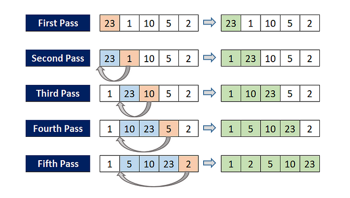
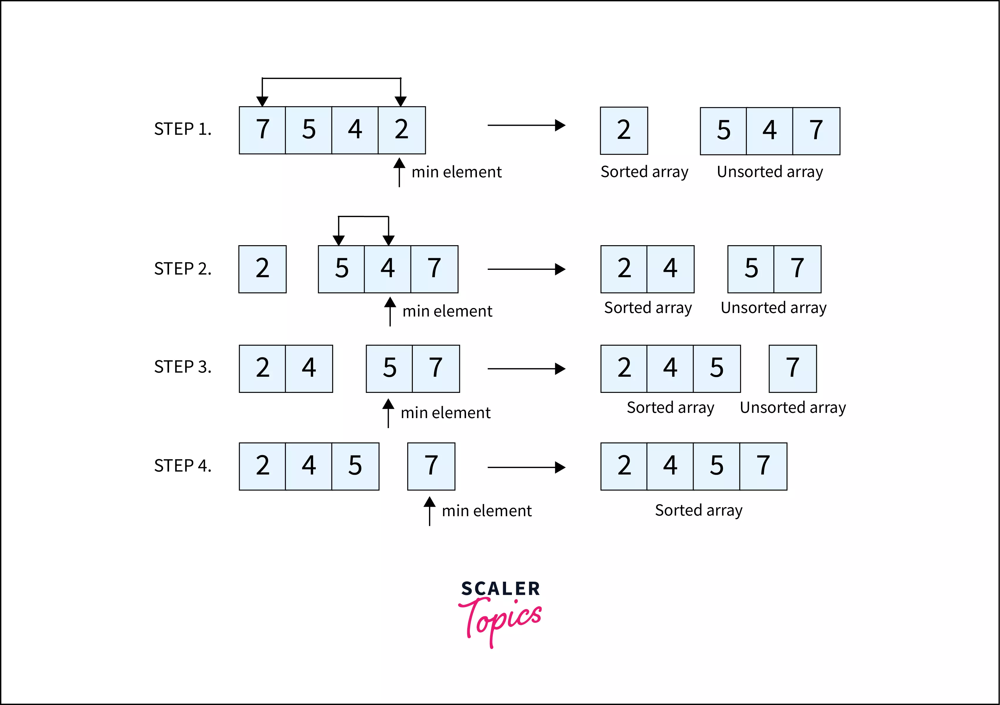
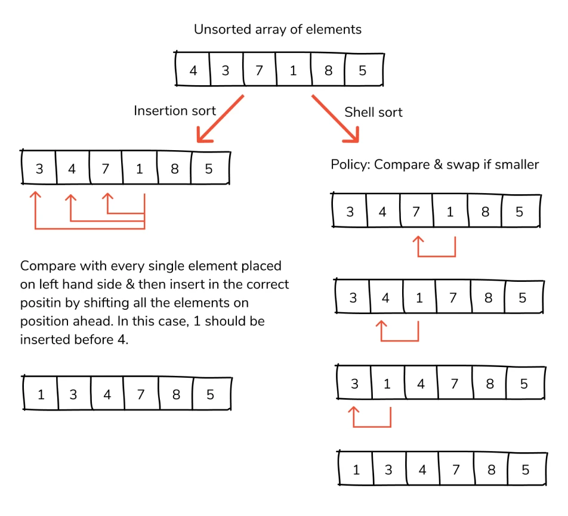
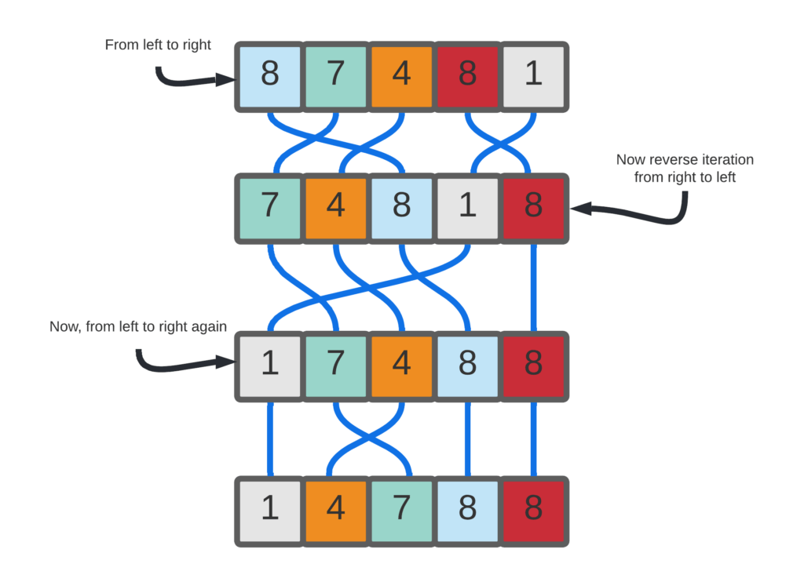
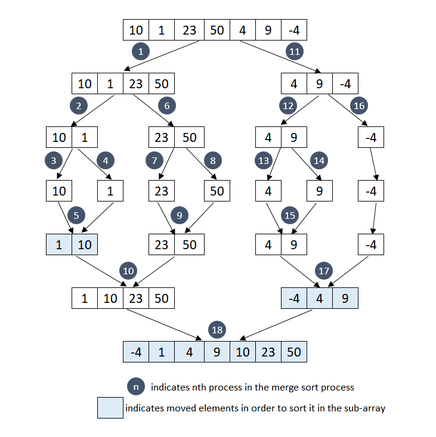

# Big O notion to measure

an overview of how we use Big O notation to measure the time complexity of sorting algorithms. By understanding the time complexity of different algorithms, we can choose the most efficient algorithm for the size and type of data that we need to sort. This can lead to significant improvements in program performance.

## Bubble Sort

Bubble sort is a type of sorting algorithm you can use to arrange a set of values in ascending order. If you want, you can also implement bubble sort to sort the values in descending order.
    

## Insertion Sort

Insertion sort is a simple sorting algorithm that builds the final sorted array (or list) one item at a time by comparisons. It is much less efficient on large lists than more advanced algorithms such as quicksort, heapsort, or merge sort.

## Quick sort

Quicksort is a sorting algorithm based on **the divide and conquer** approach where

- An array is divided into subarrays by selecting a pivot element (element selected from the array).

- While dividing the array, the pivot element should be positioned in such a way that elements less than pivot are kept on the left side and elements greater than pivot are on the right side of the pivot.
- The left and right subarrays are also divided using the same approach. This process continues until each subarray contains a single element.
- At this point, elements are already sorted. Finally, elements are combined to form a sorted array.

## selection sort

Selection sort is a sorting algorithm that selects the smallest element from an unsorted list in each iteration and places that element at the beginning of the unsorted list.

## shell sort
Shell sort algorithm is very similar to that of the Insertion sort algorithm. In case of Insertion sort, we move elements one position ahead to insert an element at its correct position. Whereas here, Shell sort starts by sorting pairs of elements far apart from each other, then progressively reducing the gap between elements to be compared. Starting with far apart elements, it can move some out-of-place elements into the position faster than a simple nearest-neighbor exchange.

## cocktail sort

Cocktail sort is similar to the bubble sort in which both are
even and comparison‐based sorting algorithms The Cocktail algorithm differs from a bubble sort in
that it sorts in both directions on each pass through the list This sorting algorithm is more difficult
to implement than the bubble sort  The first rightward
pass will shift the largest element to its correct place at the
end, and the following leftward pass will shift the smallest
element to its correct place at the beginning. The second
complete pass will shift the second largest and second
smallest elements to their correct places, and so on. [for more viste this journal](https://www.irjet.net/archives/V4/i1/IRJET-V4I1249.pdf)

## count sort

Counting sort is an algorithm for sorting a collection of
objects according to keys that are small integers. It operates by
counting the number of objects that have distinct key
value, and using arithmetic on those counts to determine
the positions of each key value in the output sequence An important property of counting sort is that it is stable:
numbers with the same value appear in the output array
in the same order as they do in the input array as shown
in Figure 6. That is, it breaks ties between two numbers by
the rule that whichever number appears first in the input
array it also appears first in the output array. Normally,
the property of stability is important only when satellite
data are carried around with the element being sorted.
Counting sort’s stability is important for another reason:
counting sort is often used as a subroutine in radix sort, in
order for radix sort to work correctly, counting sort must
be stable.

## merge sort

Merge sort is one of the most efficient sorting algorithms. It is based on the divide-and-conquer strategy. Merge sort continuously cuts down a list into multiple sublists until each has only one item, then merges those sublists into a sorted list.

## quick sort hoar
## shuffle sort 
Shuffle sort, also known as random sort, is a simple sorting algorithm that shuffles the elements of an array randomly. The algorithm begins by swapping the last element of the array with a randomly chosen element from the entire array. Then, it selects the second-to-last element and swaps it with another random element from the remaining array, excluding the last element, and so on until the entire array is sorted. Despite its simplicity, shuffle sort is not an efficient sorting algorithm and is generally used for educational purposes rather than practical applications due to its average-case time complexity of O(n^2).

# Credits

**Many thanks to [littleblack111](https://github.com/littleblack111) for his contributions.**
